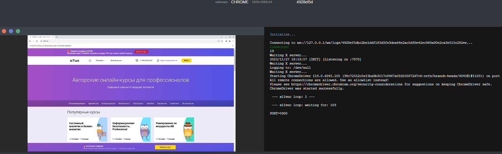
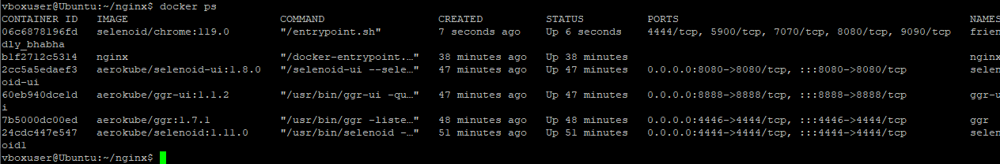

# OTUSLearning
Обучение на курсе OTUS Java QA Engineer. Professional

ДЗ #4: Подключение Selenoid

команды для создания докер контейнеров 

docker run -d --rm --network selenoid_1 --name selenoid1 -p 4444:4444 -v /var/run/docker.sock:/var/run/docker.sock -v /home/vboxuser/selenoid/:/etc/selenoid:ro aerokube/selenoid:1.11.0 -container-network=selenoid_1  -limit 12

docker run -d --name ggr -v /etc/grid-router/:/etc/grid-router:ro -p 4446:4444 aerokube/ggr:1.7.1 -guests-allowed -guests-quota "test" -verbose -quotaDir /etc/grid-router/quota

docker run -d --name ggr-ui -p 8888:8888 -v /etc/grid-router/quota/:/etc/grid-router/quota:ro aerokube/ggr-ui:1.1.2

docker run -d --name selenoid-ui -p 8080:8080 aerokube/selenoid-ui:1.8.0 --selenoid-uri http://172.17.0.1:8888

docker run --name nginx -v /home/vboxuser/nginx/:/etc/nginx/conf.d:ro -d --network=host nginx

Доступ с локальной машины Windows

http://127.0.0.1/ - до selenoid_ui

http://127.0.0.1/wd/hub/ - до ggr

Скрин сессии автотеста

Список контейнеров через SSH в Putty
